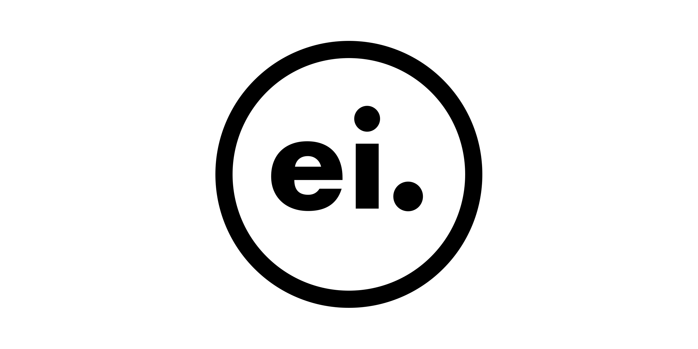

<!-- Display logo centered -->
<p align="center">
  
</p>

<p align="center">
    <b> Fast, maintainable, interpretable ML code </b>
</p>


# Introducing einexpr

`einexpr` brings Einstein summation notation to Python.

Einstein summation notation encourages explicit dimension naming and can **dramatically reduce the mental overhead of working with multi-dimensional arrays**.

## In action

```python
import einexpr as ei
import numpy as np

# Define some vectors
a = ei.array([1,2])
b = ei.array([3,4])
# (So far, pretty normal...)

# Dot product
x = a['i'] * b['i']
assert np.dot(a, b) == x['']  # <-- x[''] collapses (by summing) along dimensions i, turning x['i'] into a scalar

# Outer product
x = a['i'] * b['j']
assert np.all(np.outer(a, b) == x['i j'])

# Define some matrices
X = ei.array([[1, 2], [3, 4]])
Y = ei.array([[5, 6], [7, 8]])

# Flatten
x = X['i j']
assert np.all(np.reshape(X, (-1,)) == x['(i,j)'])

# Matrix-vector multiplication
x = X['i j'] * a['j']
assert np.all(np.matmul(X, a) == x['i'])
```

`einexpr`'s dimension structure conventions are designed to be intuitive, flexible, and unambiguous.

In the above examples, the **string** inside the square brackets specifies the dimension structure.

You can also pass dimensions around as **first-class objects**:

```python
i, j, k = ei.dims(3)

x = X[i, j] * Y[j, k]
assert np.all(np.matmul(X, Y) == x[i, k])
```

There's no trade-off: feel free to combine strings and objects in any way that you find convenient.

```python
i, j, k = ei.dims('i j k')

Z = X[i, j] * Y[j, k]

# Equivalent ways of flattening along j and k
Z['i (j k)']
Z[i,(j,k)]
Z['i',('j','k')]
jk = (j,k)
Z['i', jk]

# We can check that the dimensions are correct using the `dims` property
assert Z['i (j k)'].dims == ('i', ('j', 'k'))
...
```

# Installation

`einexpr` makes extensive use of features added recently to some of its dependencies but not yet available in the release versions, so it is recommended that you install the development versions of Numpy and Ivy for now.

```bash
pip install --upgrade git+https://github.com/numpy/numpy
pip install --upgrade git+https://github.com/unifyai/ivy
pip install einexpr
```

## Integration

While `einexpr` is ready for the world, the Python ecosystem is not *quite* ready for `einexpr`.

### ❤️ Array API standard

`einexpr` is built with first-class support for Python array API standard-conforming libraries. This means that `einexpr` will have excellent long-term support for NumPy, PyTorch, TensorsFlow, JAX, and other array libraries. However, since standard is rather new, none of these libraries have finished implementing it yet. Don't worry, though: the devs are probably working on it right now! (e.g. [PyTorch](https://github.com/pytorch/pytorch/issues/58743)).

### ❤️ Ivy

Ivy is a library that provides a unified interface to a variety of array libraries. It serves a similar purpose to the array API standard, but aims to support a much broader set of functionality and has a different approach to standardisation. It passes calls to Ivy methods into equivalent calls to methods in a variety of backends, including NumPy, PyTorch, TensorFlow, JAX, and MXNet, by converting arguments and return values to and from a commom. Like the array API standard, Ivy is still a work in progress. But, unlike the array API standard, it can be used today.

In future, it is likely that all major array libraries will support the array API standard. `einexpr` prefers to use the array API of its input array, if available. Otherwise, it defaults to Ivy. Since Ivy will also support the array API standard, there will eventually be no functional difference from the users' point of view for array API functions, so `einexpr`'s interface will be consistent across backends. In the meantime, Ivy's discrepencies with the array API standard may cause some inconsistencies in the behavior of `einexpr` between backends.